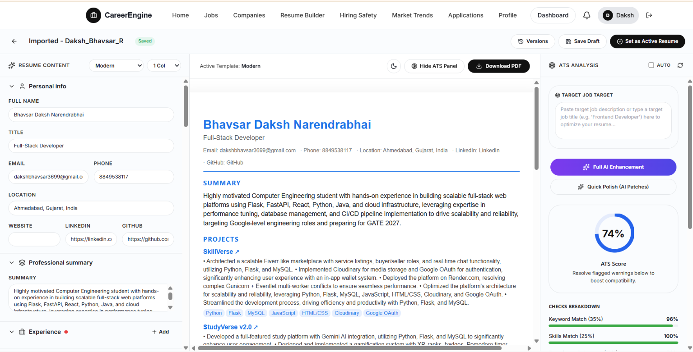
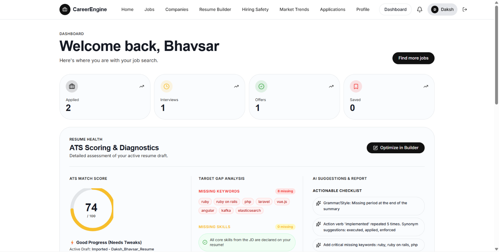
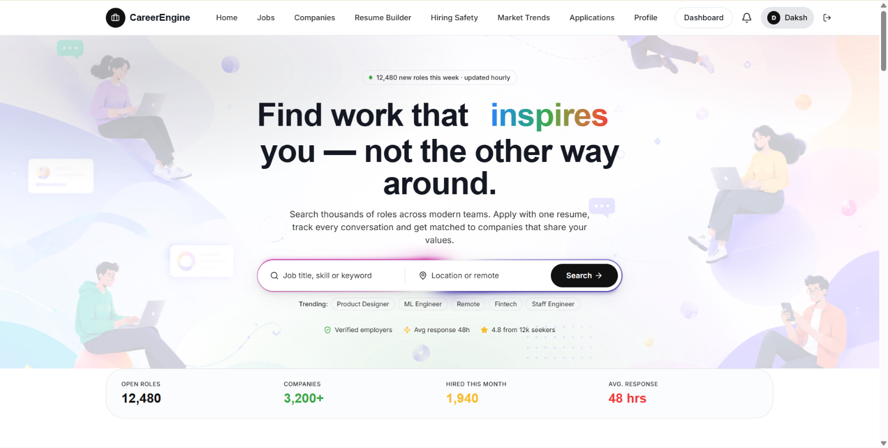
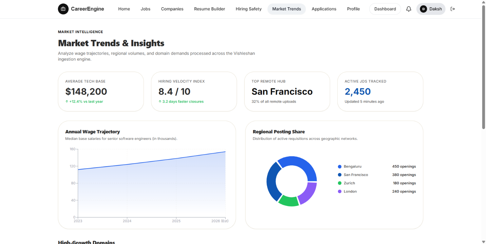

<div align="center">
  

  <h1 align="center">Vishleshan — Multi-Agent Recruitment Intelligence Platform</h1>

  <p align="center">
    <strong>A multi-agent AI system for semantic resume parsing, candidate matching, fraud detection, and recruitment automation — built for enterprise HR teams and developer integrations.</strong>
  </p>

  <p align="center">
    <a href="#architecture">Architecture</a> •
    <a href="#multi-agent-system">Agents</a> •
    <a href="#features">Features</a> •
    <a href="#quick-start">Quick Start</a> •
    <a href="#admin-dashboard">Admin Panel</a> •
    <a href="#developer-portal">Developer Portal</a> •
    <a href="#api-reference">API Reference</a> •
    <a href="#security">Security</a> •
    <a href="#license--attributions">License</a>
  </p>

  <p align="center">
    
    
    
    
    
    
    
    
  </p>
</div>

---

## Overview

**Vishleshan** is a production-grade, multi-agent AI platform that automates the entire recruitment pipeline — from resume ingestion and skill extraction to candidate ranking, AI-powered interviews, and fraud detection. It uses a coordinated system of specialized LLM agents, vector databases, and asynchronous workers to transform unstructured documents into actionable intelligence.

The platform serves **four** distinct user groups:
- **Recruiters** — A full-featured Applicant Tracking System (ATS) with AI screening, matching, and analytics
- **Job Seekers** — A job discovery portal with AI resume builder, safety verification, and legitimacy checks
- **Developers** — A SaaS API portal with subscription billing, rate limiting, and usage dashboards
- **Administrators** — A dedicated moderation dashboard with ban/unban controls, support ticket management, and audit logging

---

## Multi-Agent System

Vishleshan's core intelligence is powered by a coordinated system of **12+ specialized AI agents**, each responsible for a distinct task in the recruitment pipeline:

| Agent | File | Responsibility |
|-------|------|---------------|
| **Resume Parsing Agent** | `agents/parsing_agent.py` | Extracts structured data (skills, experience, education, projects) from PDF/DOCX/TXT files using LLM-guided extraction |
| **Advanced ATS Parser** | `agents/advanced_ats_parsing_agent.py` | Deep ATS compatibility analysis with section-by-section scoring |
| **ATS Compatibility Agent** | `agents/ats_compatibility_agent.py` | Scores resume formatting, keywords, and structure against industry ATS standards |
| **Skill Normalization Agent** | `agents/normalization_agent.py` | Maps raw extracted skills to a canonical taxonomy of 1,000+ technical and soft skills with synonym resolution |
| **Matching Agent** | `agents/matching_agent.py` | Computes semantic match scores between candidate profiles and job descriptions using vector similarity and weighted criteria |
| **Inference Agent** | `agents/inference_agent.py` | Infers missing candidate attributes (seniority level, role category, domain expertise) from available resume data |
| **AI Chatbot Agent** | `agents/chatbot_agent.py` | Powers natural language candidate queries — ask questions like "Find Python developers with 3+ years in fintech" |
| **Fraud Detection Agent** | `agents/fraud_agent.py` | Scans resumes and job postings for plagiarism, AI-generated content, ATS keyword stuffing, and phishing patterns |
| **Interview Agent** | `agents/interview_agent.py` | Conducts AI-powered mock interviews with dynamic follow-up questions |
| **Resume Enhancer Agent** | `agents/resume_enhancer_agent.py` | Suggests improvements to resume content, formatting, and keyword optimization |
| **Salary Prediction Agent** | `agents/salary_prediction_agent.py` | Predicts compensation ranges using ML models and market data |
| **Cover Letter Agent** | `agents/cover_letter_agent.py` | Generates tailored cover letters based on resume and job description |
| **MCQ Paper Parser** | `agents/mcq_paper_parser_agent.py` | Auto-generates MCQ assessments matching job requirements |
| **Resume Quality Agent** | `agents/resume_quality_agent.py` | Evaluates overall resume quality with actionable improvement scores |
| **Job Recommendation Agent** | `agents/job_recommendation_agent.py` | Recommends relevant jobs based on seeker profile and preferences |
| **JD Generator Agent** | `agents/jd_generator_agent.py` | Generates optimized job descriptions from role requirements |
| **LLM Router** | `agents/llm.py` | Manages API key rotation across multiple Gemini keys with automatic failover, rate-limit recovery, and load balancing |

All agents communicate through the `RotateLLMClient`, which distributes requests across a pool of API keys and automatically handles quota exhaustion, retries, and model selection.

---

## Features

### Recruiter Dashboard (ATS)
- **Batch Resume Upload** — Drag-and-drop PDF/DOCX files with async Celery processing
- **AI Skill Extraction** — Multi-agent pipeline extracts skills, experience, contact details, and projects
- **Semantic Job Matching** — Vector-based scoring against job descriptions with configurable skill weights
- **AI Chatbot** — Query your candidate pool in natural language
- **Session Management** — Multi-round hiring workflows with configurable evaluation criteria
- **Gmail & Google Drive Sync** — Import resumes directly from email attachments and cloud folders
- **Company Settings** — Upload company logos, configure branding, and manage team profiles
- **Analytics Dashboard** — Hiring velocity, pipeline health, and candidate quality metrics

### Fraud Detection & Protection
- **Resume Authenticity Scanning** — Detects AI-generated content, plagiarism, and invisible keyword stuffing
- **Job Posting Verification** — Flags phishing scams, ghost job indicators, and clone copy-paste listings
- **AI Fake Job Detection System** — Fully integrated 6-point verification checklist:
  1. *Official Website Validation* (corporate domain and security certificates)
  2. *Recruiter Email Domain Verification* (matches registered corporate domain)
  3. *Salary Realism Evaluation* (compensation vs. local market standards)
  4. *LinkedIn Company Presence Check* (professional networking platform lookup)
  5. *Suspicious/Copied Description Analysis* (boilerplate scam template detection)
  6. *Duplicate/Repeated Posting Detection* (mass automation pattern scanning)
- **Legitimacy Score Output** — Real-time Trust Score (/100), Risk Level, Verified Company status, and Approved/Suspicious classification
- **Scan History** — Full audit trail with dynamic interactive breakdowns

### Job Seeker Portal
- **Dedicated Seeker Accounts** — Separate login/registration with OTP verification (SMS via 2Factor + Email via Brevo)
- **AI Resume Builder & Editor** — 7 professional templates (Modern, Classic, Minimal, Executive, Creative, Compact, ATS Optimized)
- **High-Fidelity Template Previews** — Exact rendered images matching actual template structures
- **Dynamic Column Selector** — Toggle between 1-column and 2-column layouts
- **ReportLab PDF Exporter** — Multi-page 2-column PDF generation with dynamic pagination
- **Profile Auto-Sync** — Setting a resume as "Active" syncs skills, experience, and education to the seeker profile
- **Double-Input Job Search** — Keyword + location search with Indian city-to-state autocomplete
- **Real-time Notifications** — In-app notification center and email alerts on application status changes
- **Hiring Safety Checker** — Company domain authenticity scanner before applying
- **Salary Trends & Analytics** — Interactive sector salary and demand charts
- **Google & GitHub OAuth** — One-click social sign-in across all portals
- **Mock Interview Practice** — AI-powered voice/chat interview simulation with scoring and feedback
- **Company Discovery** — Browse, follow, and explore company profiles and open positions
- **Applications Pipeline** — Track application status with visual pipeline stages

### Admin Dashboard
- **Dedicated Admin Login** — Separate `/admin/login` page with Combined (IP + Email) rate limiting
- **User Moderation** — Ban/unban any seeker, recruiter, or developer with atomic Redis cache invalidation
- **Self-Ban Prevention** — Admin email matching blocks accidental self-banning
- **Support Ticket Management** — View, resolve, and respond to user support requests
- **Audit Logging** — Every ban/unban action is recorded in `AdminBanLog` with timestamp and admin email
- **Banned User Enforcement** — Banned users are immediately blocked on all API calls (Redis-cached, DB-fallback)
- **Session Invalidation** — Active JWT tokens are rejected mid-session when a user is banned
- **Short Token Expiry** — Admin JWT tokens expire in 20 minutes

### Developer Portal (SaaS API)
- **REST API** — Programmatic access to resume parsing, matching, chatbot, and fraud scanning
- **API Key Management** — Generate, rotate, and revoke production/test keys
- **Subscription Billing** — Razorpay-integrated plans (Free, Starter, Business, Enterprise) with monthly quotas
- **Rate Limiting** — Redis-backed per-key monthly quotas for parse, match, chat, and scan operations
- **Usage Analytics** — Real-time traffic charts, endpoint latency, and monthly usage breakdowns
- **Webhooks** — Configure HTTP callbacks for async parsing completion events
- **Embed Widget** — Generate secure tokens to mount Vishleshan UI in external applications
- **API Documentation** — Interactive playground with request/response examples

### Candidate Assessment Rounds
- **MCQ Round** — Auto-generated Technical, Conceptual, and Aptitude questions matching job requirements
- **Coding Round** — Custom programming challenges with in-browser code editor and test-case grading
- **AI Interview Round** — Dynamic conversational interview with sequential follow-up questions, scoring, and feedback

---

## Architecture

The platform is built as a monorepo with two primary pillars:

### `backend/` — The AI Engine
- **Framework**: Django 5 + Django REST
- **Database**: PostgreSQL (Neon serverless / Supabase)
- **Cache & Rate Limiting**: Redis (ban status caching, JWT blacklisting, rate limiting)
- **Vector Store**: ChromaDB for semantic similarity search
- **Task Queue**: Celery with threaded pool for async resume processing
- **LLM Provider**: Google Gemini (multi-key rotation with automatic failover)
- **Authentication**: JWT tokens (recruiter/seeker/admin) + API keys (developer)
- **SMS**: 2Factor Gateway for OTP delivery
- **Email**: Brevo (Sendinblue) for transactional emails, verification codes, and notifications

### `frontend/` — The React SPA
- **Framework**: React 18 + Vite 8
- **Styling**: Tailwind CSS 3
- **State Management**: Zustand
- **Data Fetching**: TanStack React Query
- **Charts**: Recharts
- **Animations**: Framer Motion + GSAP
- **UI Components**: Radix UI primitives
- **Routing**: React Router v7 with nested layouts

The frontend hosts all four portals as a single SPA with path-based routing:
- `/` — Recruiter landing page
- `/dashboard/*` — Recruiter ATS dashboard
- `/jobs/*` — Job seeker portal
- `/developer/*` — Developer API portal
- `/admin/*` — Admin moderation dashboard

---

## Platform Highlights

### 1. Interactive Recruiter ATS (Applicant Tracking System)
Complete AI evaluation panels with semantic match scoring, candidate filtering, and multi-round hiring pipelines.

<div align="center">
  
</div>

### 2. Recruiter Recruitment Sessions
Track and manage all hiring rounds, candidates, and job applications in one visual board.

<div align="center">
  
</div>

### 3. Interactive AI Resume Builder & Editor
Build your resume using high-fidelity templates with a real-time side-by-side ATS compatibility score and AI suggestions.

<div align="center">
  
</div>

### 4. Job Seeker Dashboard & ATS Scoring
Track your applications pipeline and review real-time feedback with a breakdown of keywords, skills, formatting, and experience.

<div align="center">
  
</div>

### 5. Developer API Portal (SaaS Dashboard)
Full SaaS portal for third-party integrations with usage analytics, Razorpay subscription billing, and interactive documentation.

<div align="center">
  
</div>

### 6. Job Seeker Landing & Smart Job Discovery
City-aware job search, live state-to-city Indian autocomplete suggestions, and domain safety verification.

<div align="center">
  
</div>

### 7. Market Trends & Salary Insights
Interactive wage trajectories, hiring velocity index, and region-wise job opening distribution charts.

<div align="center">
  
</div>

---

## Quick Start

### One-Click Development Start (Windows)

For Windows environments, you can boot the entire local workspace (Vite Frontend, Django Backend, Redis, and Celery worker) using the provided batch script:

```cmd
run.bat
```

---

### Manual Setup & Requirements

#### 1. Requirements
- Node.js `v18+`
- Python `v3.10+`
- PostgreSQL, Redis, ChromaDB (running locally or remotely)

#### 2. Backend Setup
```bash
cd backend
cp .env.example .env

# Install Python dependencies
pip install -r requirements.txt

# Configure environment variables in .env:
# GEMINI_API_KEYS — comma-separated list of Gemini API keys
# GEMINI_MODEL — e.g. gemini-2.5-flash
# GOOGLE_OAUTH_CLIENT_ID, GOOGLE_OAUTH_CLIENT_SECRET — Google OAuth
# GITHUB_CLIENT_ID, GITHUB_CLIENT_SECRET — GitHub OAuth
# BREVO_API_KEY — Email & SMS service
# TWOFACTOR_API_KEY — SMS OTP gateway
# RAZORPAY_KEY_ID, RAZORPAY_KEY_SECRET — Payment gateway
# ADMIN_EMAIL, ADMIN_PASSWORD — Admin panel credentials
# DATABASE_URL — PostgreSQL connection string
# REDIS_URL — Redis connection string

# Run Database Migrations
python manage.py migrate

# Seed the Skill Taxonomy table (one-time)
python manage.py seed_skills

# Run the Django Dev Server
python manage.py runserver 8000

# Run the Celery Worker (multi-threaded pool on Windows)
celery -A workers.celery_worker worker --loglevel=info --pool=threads --concurrency=4
```

#### 3. Frontend Setup
```bash
cd frontend
npm install
cp .env.local.example .env.local
# Configure VITE_GOOGLE_CLIENT_ID, VITE_GITHUB_CLIENT_ID, VITE_BREVO_MA_KEY
npm run dev
```

The frontend runs on port `5173` by default and serves all four portals (Recruiter, Job Seeker, Developer, Admin) from a single Vite dev server.

---

## API Reference

### Resume Parsing
```bash
curl -X POST "https://api.vishleshan.ai/api/v1/parse" \
  -H "X-API-Key: vish_live_xxxxxxxxxxx" \
  -F "file=@resume.pdf"
```
```json
{
  "success": true,
  "data": {
    "candidate_id": "cnd_9248239a",
    "name": "John Doe",
    "email": "johndoe@email.com",
    "skills": ["Distributed Systems", "Go", "Python"],
    "experience_years": 4.5
  }
}
```

### Fraud Detection Scan
```bash
curl -X POST "https://api.vishleshan.ai/api/v1/protection/scan" \
  -H "X-API-Key: vish_live_xxxxxxxxxxx" \
  -d '{
    "scan_type": "job",
    "job_title": "Senior Frontend Engineer",
    "job_description": "We are looking for a React developer..."
  }'
```
```json
{
  "success": true,
  "data": {
    "job_title": "Senior Frontend Engineer",
    "company_name": "Google",
    "originality_score": 94,
    "ai_probability": 6,
    "plagiarism_score": 5,
    "status": "Approved",
    "risk_level": "Low",
    "verified_company": "Yes",
    "flags": ["Source: LinkedIn"],
    "detailed_checks": {
      "official_website": { "status": "Yes", "details": "Official domain and secure certificates verified." },
      "recruiter_email": { "status": "Yes", "details": "Recruiter email domain matches company domain." },
      "salary_realistic": { "status": "Yes", "details": "Compensation aligns with market standards." },
      "linkedin_presence": { "status": "Yes", "details": "Found active company page on LinkedIn." },
      "description_copied": { "status": "No", "details": "Job requirements are custom-tailored." },
      "repeated_posts": { "status": "No", "details": "No duplicate posting signatures found." }
    },
    "summary": "Verification complete. Job listing appears safe and authentic."
  }
}
```

### Rate Limits by Plan

| Tier | Parses/mo | Match Ops/mo | Chat Queries/mo | Safety Scans/mo |
|------|-----------|-------------|-----------------|-----------------|
| Free | 100 | 50 | 20 | 0 |
| Starter | 1,000 | 500 | 200 | 100 |
| Business | 10,000 | Unlimited | Unlimited | 1,000 |
| Enterprise | Unlimited | Unlimited | Unlimited | Unlimited |

---

## Tech Stack

| Layer | Technology |
|-------|-----------|
| Frontend | React 18, Vite 8, Tailwind CSS 3, Zustand, Recharts, Framer Motion, GSAP, Radix UI |
| Backend | Django 5, Celery, PostgreSQL (Neon), Redis, ChromaDB |
| AI/LLM | Google Gemini (multi-key rotation), Custom 12+ agent pipeline |
| Payments | Razorpay |
| SMS & Email | 2Factor (OTP), Brevo/Sendinblue (Transactional Email) |
| Auth | JWT + API Key + Google OAuth + GitHub OAuth |
| Deployment | Render (Backend), Vercel (Frontend), Neon (Database) |

---

## Project Structure

```
.
├── backend/
│   ├── agents/               # Multi-agent LLM system (12+ agents)
│   │   ├── parsing_agent.py
│   │   ├── normalization_agent.py
│   │   ├── matching_agent.py
│   │   ├── fraud_agent.py
│   │   ├── interview_agent.py
│   │   ├── resume_enhancer_agent.py
│   │   ├── salary_prediction_agent.py
│   │   └── llm.py            # LLM Router with multi-key rotation
│   ├── api/
│   │   ├── models.py          # Django ORM models
│   │   ├── views/
│   │   │   ├── admin_views.py     # Admin dashboard & moderation
│   │   │   ├── recruiter_auth.py  # Recruiter auth & profile
│   │   │   ├── seeker_auth.py     # Job seeker auth & profile
│   │   │   ├── seeker_jobs.py     # Job search & applications
│   │   │   ├── seeker_resume.py   # Resume management
│   │   │   ├── seeker_resume_builder.py  # AI resume builder
│   │   │   ├── protection.py     # Fraud detection endpoints
│   │   │   ├── round_views.py    # MCQ/Coding/Interview rounds
│   │   │   ├── sessions.py       # Recruitment session management
│   │   │   ├── developer/        # Developer portal APIs
│   │   │   ├── verification.py   # OTP & email verification
│   │   │   └── ...
│   │   ├── services/
│   │   │   ├── email_service.py       # Brevo email templates
│   │   │   ├── twofactor_service.py   # SMS OTP via 2Factor
│   │   │   ├── brevo_service.py       # Brevo CRM & tracking
│   │   │   └── notification_service.py
│   │   ├── decorators.py      # Auth, rate limiting, ban checks
│   │   ├── middleware.py      # CORS, usage logging
│   │   └── urls.py            # URL routing (25+ route groups)
│   ├── workers/               # Celery async task workers
│   ├── tests/                 # Unit & integration tests
│   ├── models/                # ML models & schemas
│   └── requirements.txt
├── frontend/
│   └── src/
│       ├── components/        # 47+ shared UI components
│       ├── pages/
│       │   ├── admin/         # Admin dashboard & login
│       │   ├── developer/     # Developer portal (12 pages)
│       │   ├── seeker/        # Seeker-specific pages
│       │   ├── user/          # Job seeker user pages (14 pages)
│       │   ├── test/          # Assessment round pages
│       │   ├── public/        # About, Terms, Contact, Refund
│       │   └── ...            # Landing, Auth, Dashboard, etc.
│       ├── stores/            # Zustand state management
│       └── lib/               # API clients & utilities
├── assets/                    # Screenshots & design assets
├── SECURITY.md                # Security policy & disclosure
├── CONTRIBUTING.md            # Contribution guidelines
├── LICENSE                    # MIT License
└── README.md
```

---

## Security

Vishleshan includes comprehensive security controls:

- **IDOR Protection** — Enforces company/seeker ownership checks on all candidate management views
- **JWT Blacklisting** — Revokes tokens instantly upon logout using Redis-based blacklist with auto-expiration
- **Redis Ban Status Caching** — 300s TTL cache with graceful DB fallback when Redis is unavailable
- **Atomic Cache Invalidation** — Ban/unban operations clear Redis cache via `transaction.on_commit()` to prevent stale windows
- **Combined Rate Limiting** — IP + Email rate limiting on admin login and support ticket endpoints with masked identifiers in 429 responses
- **Admin Self-Ban Prevention** — Case-insensitive email matching against `ADMIN_EMAIL` prevents accidental admin lockout
- **Short Admin Token Expiry** — Admin JWT tokens expire in 20 minutes
- **Audit Logging** — `AdminBanLog` records every moderation action with admin email, target, and timestamp
- **XSS Protection** — HTML template variables escaped at render-time (not storage) using `django.utils.html.escape`
- **Content Injection Protection** — ReportLab PDF text inputs recursively HTML-escaped
- **Error Sanitization** — Production responses mask internal details, returning generic correlation IDs
- **LLM Key Rotation** — `RotateLLMClient` distributes across multiple Gemini API keys to prevent single-key exposure
- **CORS Configuration** — Restricted allowed origins in production

> [!WARNING]
> **Credential Rotation**: All API keys, passwords, and connection URIs must be configured through `.env` files and are excluded from version control. If deploying to production, **immediately rotate all previously used API keys** that may persist in Git commit history.

For the full security policy, vulnerability reporting instructions, and severity classifications, see [SECURITY.md](SECURITY.md).

---

## License & Attributions

This project is licensed under the **MIT License** — see the [LICENSE](LICENSE) file for details.

### Academic Context
**Built as a Sem-IV Project at DAIICT** | *Multi-Agent Recruitment Intelligence Platform*

Engineered for optimal performance, zero-downtime operation, and seamless enterprise integration.
