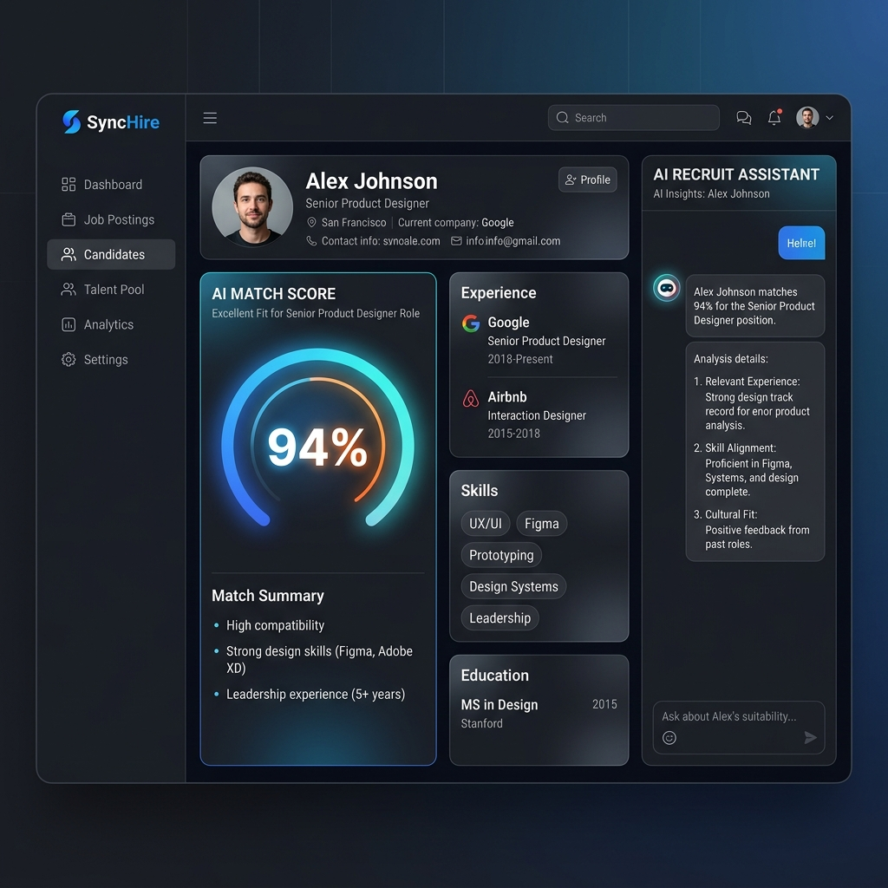

<div align="center">
  

  <h1 align="center">Vishleshan — Recruitment Intelligence Infrastructure</h1>

  <p align="center">
    <strong>A high-performance semantic resume parsing & AI candidate matching engine built for enterprise HR.</strong>
  </p>

  <p align="center">
    <a href="#architecture">Architecture</a> •
    <a href="#features">Features</a> •
    <a href="#quick-start">Quick Start</a> •
    <a href="#developer-portal">Developer Portal</a> •
    <a href="#api-reference">API Reference</a>
  </p>
</div>

---

## ⚡ Overview

**Vishleshan** is a state-of-the-art backend infrastructure and API ecosystem engineered to automate recruitment data ingestion. Utilizing advanced Local LLMs, Vector Databases, and Semantic Retrieval engines, it transforms unstructured PDFs, Word documents, and text files into rich, actionable JSON candidate profiles—all instantly queryable via natural language.

Whether you're building a massive enterprise Application Tracking System (ATS) or a niche recruiting agency platform, Vishleshan acts as your backend "Resume Intelligence" brain.

---

## 🧩 Architectural Ecosystem

Visleshan is built as a highly robust, multi-app monorepo split into three core pillars:

1. **`backend/` - The AI Engine** (FastAPI, Postgres, Redis, ChromaDB, Celery)
   - Handles strict JWT and API Key Authentication.
   - Synchronous and asynchronous parsing via advanced Worker queues.
   - Embeds candidate histories into specialized vector embeddings for sub-millisecond semantic match scoring against JD profiles.
   - Hosts real-time WebSocket bindings for interactive AI recruitment assistant Chatbots.

2. **`frontend/` - The ATS Interface** (Next.js 14, Tailwind, Zustand)
   - A fully functional Applicant Tracking System for internal recruiters.
   - Seamlessly drag-and-drop massive batches of resumes.
   - View deeply structural "Match Score" comparisons mapping candidate proficiencies specifically against active job taxonomies.

3. **`portal/` - The Developer Portal SaaS** (Next.js 14, React Query, Razorpay)
   - A standalone web portal designed specifically for 3rd-party engineering teams to buy API access to your infrastructure.
   - **Subscriptions & Billing**: Built-in Razorpay integration to purchase Free, Starter, and Business API Quotas.
   - **Analytics & Webhooks**: Deep visual traffic graphs mapping API latencies, parsing failures, and HTTP hook configurations for async processing.
   - **Embed Widget Generation**: Configure cross-origin domains and mint secure tokens to mount the Vishleshan UI directly inside external HR software interfaces.

---

## 📸 Platform Highlights

### Interactive Applicant Tracking System (ATS)
Our internal operational interface mapped specifically for recruitment leads. Complete with AI evaluation panels, granular match dials, and candidate filtering.

<div align="center">
  
</div>

### Scalable Developer SaaS Portal
Monetize your AI model. Empower client engineering teams to configure their own integration points, inspect parse latencies across their endpoints, and scale API access reliably.

<div align="center">
  
</div>

---

## 🚀 Quick Start

### 1. Requirements
- Node.js `v18+`
- Python `v3.10+`
- Docker (for PostgreSQL, Redis, Chroma DB)

### 2. Backend Setup
Boot the containerized infrastructure (Database, Vector store, Cache).
```bash
cd backend
cp .env.example .env

# Start core services
docker-compose up -d

# Install Python dependencies
pip install -r requirements.txt

# Run the FastAPI Server
uvicorn main:app --host 0.0.0.0 --port 8000 --reload
```

### 3. Frontend ATS Interface
Operates the main tool internal recruiters use on Port `3000`.
```bash
cd ../frontend
npm install
cp .env.local.example .env.local
npm run dev
```

### 4. Developer API Portal
Hosts the SaaS platform for developers buying usage tokens on Port `3001`.
```bash
cd ../portal
npm install
cp .env.example .env.local
npm run dev
```

---

## 💻 API Integration Preview

Integrating your existing HR system with the Vishleshan ingestion engine takes just seconds with any language.

```bash
# Upload and parse a candidate resume synchronously 
curl -X POST "https://api.vishleshan.ai/api/v1/parse" \
  -H "X-API-Key: vish_live_xxxxxxxxxxx" \
  -F "file=@johndoe_resume.pdf"
```
```json
{
  "success": true,
  "data": {
    "candidate_id": "cnd_9248239a",
    "name": "John Doe",
    "email": "johndoe@email.com",
    "skills": ["Distributed Systems", "Go", "Python"],
    "experience_years": 4.5
  }
}
```

---

## 🛡️ License & Attributions
Engineered and designed explicitly for optimal processing, zero-downtime, and elegant enterprise integration patterns. Restricted commercial licensure.

**Team Vision x** | *Building the Next Generation of Recruitment Intelligence.*
