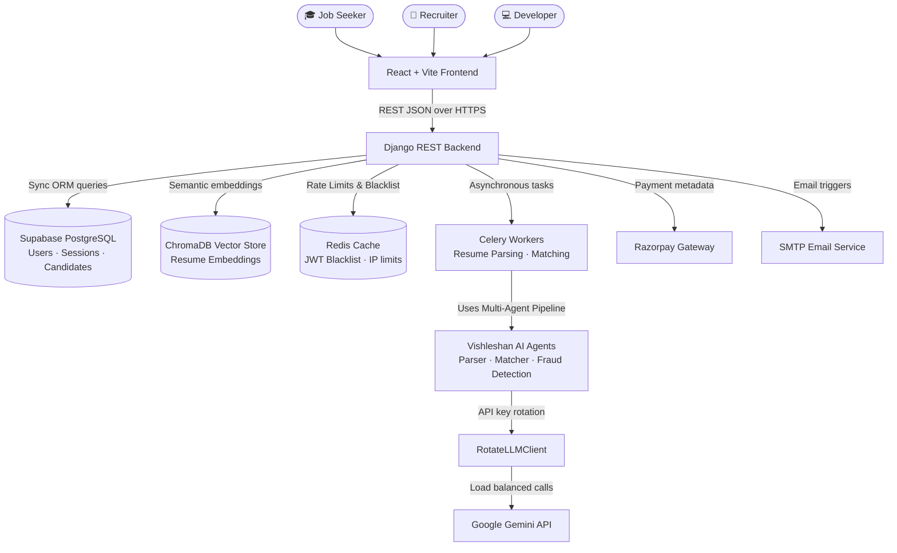
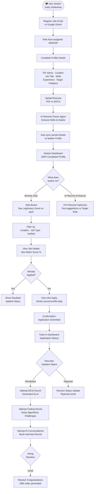
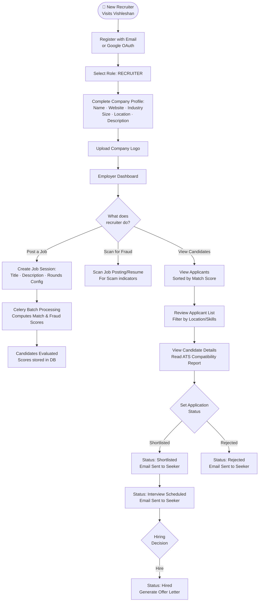
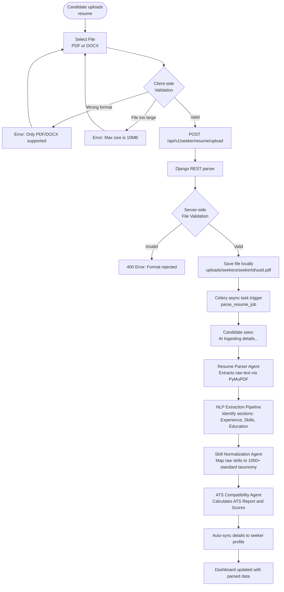
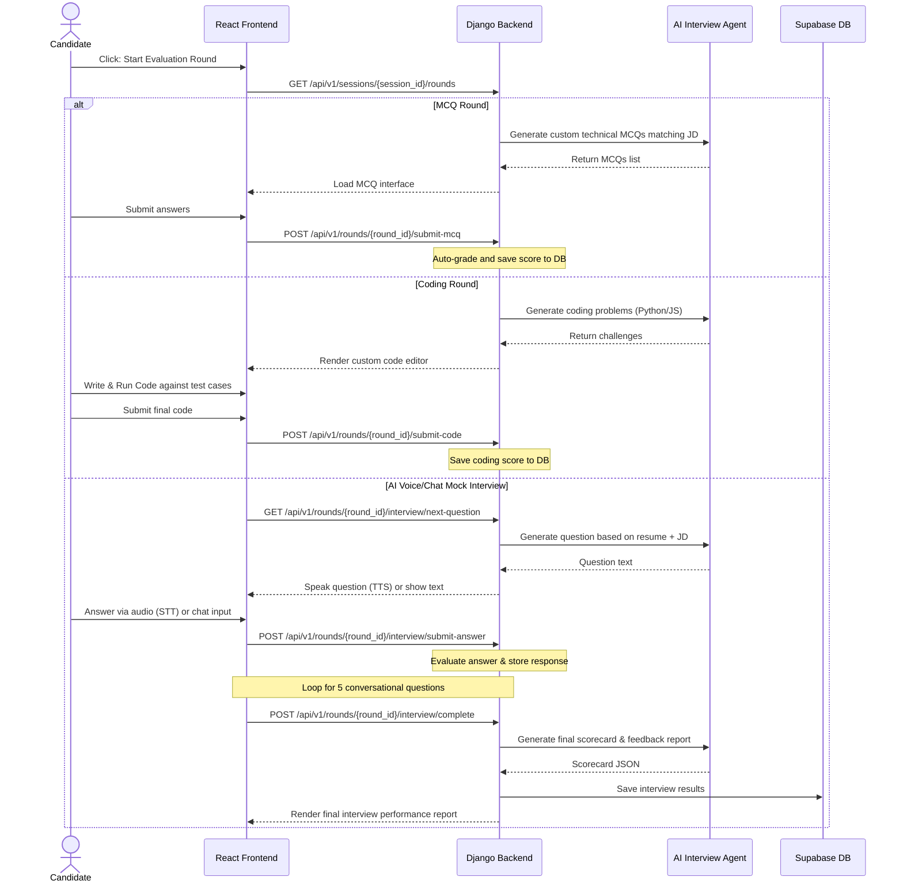
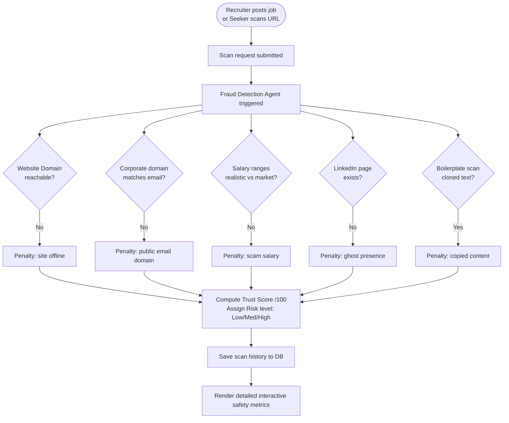
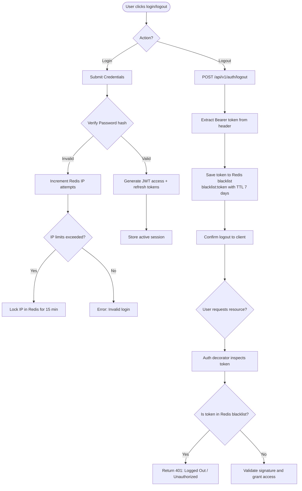

# Vishleshan — Application Flow & Architecture Document

> **Version:** 1.0.0
> **Created:** 2026-07-11
> **Status:** Active — Production Ready
> **Parent Documents:**
> - [README.md](./README.md) — Master context, vision, tech stack
> - [SECURITY.md](./SECURITY.md) — Security policies & hardening features
> **Audience:** Engineering, Design, QA, Product — anyone building, testing, or reviewing the platform

---

## 1. 📋 Document Purpose

This document maps every major user journey and system process in **Vishleshan** using Mermaid diagrams. It answers the question: **"What happens when?"** — for every actor, interaction, and AI pipeline in the platform.

---

## 2. 🗺️ Platform Overview — System Context

---

## 3. 👤 Job Seeker Journey

### 3.1 Full Candidate Lifecycle

---

## 4. 🏢 Recruiter Journey

### 4.1 Full Recruiter Lifecycle

---

## 5. 📄 Resume Upload & ATS Parsing Flow

---

## 6. 🎙️ AI Evaluation & Interview Flow

---

## 7. 🔍 Fraud Score (Trust Score) Flow

---

## 8. 🔐 Authentication & Token Blacklisting Flow

---

## 9. 📁 Related Documents

| Document | Purpose | Status |
|----------|---------|--------|
| [README.md](./README.md) | Platform context, multi-agent details, setup | ✅ Active (v1.0.0) |
| [SECURITY.md](./SECURITY.md) | Auth policies, data security, hardening features | ✅ Active (v1.0.0) |
| `testing/workflow_diagram_employer.png` | Visual flowchart of employer & trust scores | ✅ Active (v1.0.0) |

---

*© 2026 Vishleshan AI. Confidential — Internal Use Only.*
*AppFlow Version 1.0.0 | Created: 2026-07-11 | Author: Vishleshan Engineering Team*
