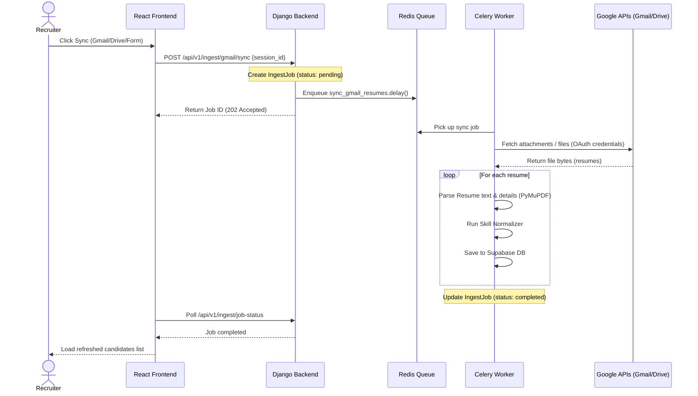

# How to Test & Explain Google Integrations (Gmail, Drive, Forms)

This guide explains how to demonstrate and explain the **Gmail**, **Google Drive**, and **Google Form** resume synchronization pipelines to external faculties or examiners.

---

## 1. 📬 Gmail Resume Sync

### How to Demonstrate
1. **Prepare a Test Email:**
   * Send an email to the connected recruiter's Gmail account (or your test Gmail account).
   * **Subject/Body:** Include keywords like `"Resume"`, `"CV"`, or `"Job Application"`.
   * **Attachment:** Attach 1 or 2 sample candidate resumes in PDF format.
2. **Connect & Sync:**
   * Go to the **Recruiter Dashboard -> Batch Import** section.
   * Click **Connect Gmail** (uses Google OAuth 2.0). Complete the authorization consent screen.
   * Click **Sync Gmail**.
3. **Verify the Output:**
   * You will see a loader showing `"Syncing Gmail attachments..."`.
   * Within ~30-60 seconds, the new candidates' parsed details will appear in the dashboard list.

### Behind the Scenes (How to Explain)
* **OAuth Credentials:** Django stores the encrypted OAuth 2.0 credentials (`gmail_tokens`) on the `Session` model.
* **Celery Task (`sync_gmail_resumes`):** The backend dispatches an async task to the Celery worker.
* **Gmail API Query:** Celery connects to the Gmail API using the credentials and queries for unread emails containing matching attachments:
  ```python
  query = "has:attachment (filename:pdf OR filename:docx) (subject:resume OR subject:cv OR resume OR cv)"
  ```
* **Processing:** The worker downloads the attachments into a temporary directory, invokes the **Resume Parsing Agent**, extracts candidate details, and saves them to the PostgreSQL database.

---

## 💾 2. Google Drive Resume Sync

### How to Demonstrate
1. **Prepare a GDrive Folder:**
   * Create a folder in your Google Drive named `"Job Applicants"`.
   * Upload 3-4 sample PDF resumes into this folder.
   * Copy the folder's shareable link (e.g. `https://drive.google.com/drive/folders/1abc123-xyz...`).
2. **Connect & Sync:**
   * In the **Batch Import** page, choose the **Google Drive** tab.
   * Paste the copied folder URL or Folder ID.
   * Click **Sync Google Drive**.
3. **Verify the Output:**
   * The loader will show `"Importing files from Google Drive..."`.
   * The resumes will be imported, parsed, and populated into your applicant list.

### Behind the Scenes (How to Explain)
* **Folder ID Parsing:** The backend extracts the Folder ID using regex:
  ```python
  folder_id = re.search(r'/folders/([a-zA-Z0-9_-]+)', folder_url).group(1)
  ```
* **Celery Task (`sync_gdrive_resumes`):** Dispatches an async Celery task.
* **Google Drive API:** Celery queries the Drive API to list all files inside the folder where MIME-type matches PDF or Word Document.
* **Batch Import:** Downloads file bytes directly, runs the multi-agent parsing pipeline, and synchronizes the candidate profiles.

---

## 📝 3. Google Form Resume Sync

### How to Demonstrate
1. **Prepare a Google Form:**
   * Create a standard job application Google Form containing: *Full Name*, *Email*, and a *File Upload* field (for resumes).
   * Fill out the form as a mock candidate and upload a PDF resume.
2. **Sync in Dashboard:**
   * Select the **Google Form** tab in the Recruiter dashboard.
   * Connect your Google Form ID or link.
   * Click **Sync Responses**.
3. **Verify the Output:**
   * The system will pull the latest spreadsheet/form response data, download the uploaded files from Google's servers, and parse them instantly.

### Behind the Scenes (How to Explain)
* **Data Integration:** Google Forms store file uploads directly in the form owner's Google Drive.
* **Celery Task (`sync_google_form_resumes`):** Connects to the Google Forms / Sheets API to read the responses.
* **File Retrieval:** Extracts the GDrive file IDs linked in the form submission responses, downloads the document bytes, and runs the parsing pipeline to create a structured candidate record.

---

## 🛠️ Summary Diagram


